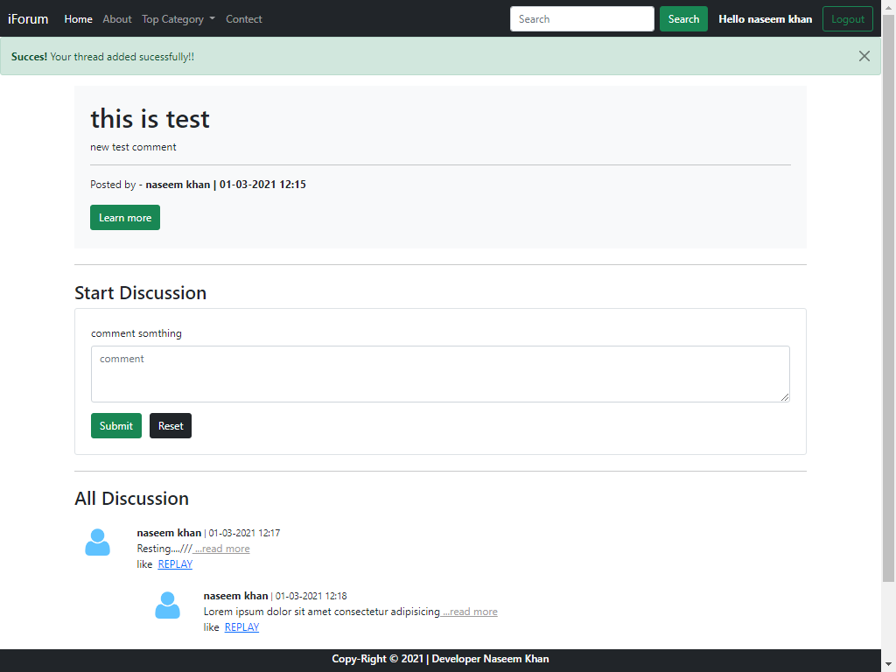

# Get Started
for Queck starting the programe install xampp from hare --> [https://www.apachefriends.org/download.html]. 

## How to use
for starting make sure all table are make properly. Than start the "mysql and apache" then search "localhost/forum" in you favorite browser.
Make sure all sql file are import in Phpmysql first make the forcomment db. than import SQL files in hare[http://localhost/phpmyadmin/db_structure.php?server=1&db=forcomment].
"Make sure this repository in this file location befor searching  -> [C:\xampp\htdocs\forum] in window same mac."

# Web preview
## Main

